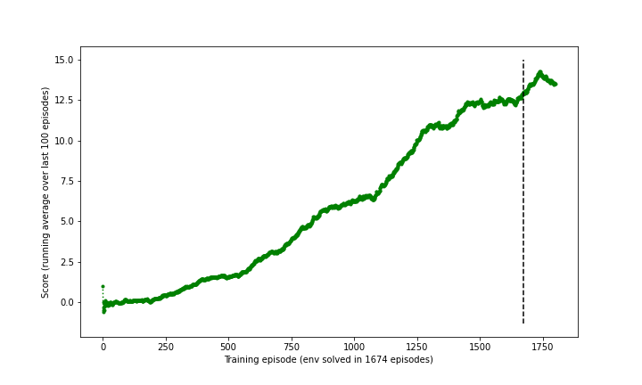

# Project 1: Navigation

### Project Details

For this project, I trained an agent to navigate (and collect bananas!) in a large, square world.

* A reward of +1 is provided for collecting a yellow banana, and a reward of -1 is provided for collecting a blue banana.
* The goal is to collect as many yellow bananas as possible while avoiding blue bananas, within 300 fixed timesteps.
* The state space has 37 continous dimensions and contains the agent's velocity, along with ray-based perception of objects around agent's forward direction.
* The action space is 1-dimensional, whose value has 4 discrete (0-indexed) options: move forward, move backward, turn left, turn right
* The task is considered solved when the agent gets an average score of +13 over 100 consecutive episodes (during training).

### Getting Started

1. Download the environment from one of the links below.  You need only select the environment that matches your operating system:
    - Linux: [click here](https://s3-us-west-1.amazonaws.com/udacity-drlnd/P1/Banana/Banana_Linux.zip)
    - Mac OSX: [click here](https://s3-us-west-1.amazonaws.com/udacity-drlnd/P1/Banana/Banana.app.zip)
    - Windows (32-bit): [click here](https://s3-us-west-1.amazonaws.com/udacity-drlnd/P1/Banana/Banana_Windows_x86.zip)
    - Windows (64-bit): [click here](https://s3-us-west-1.amazonaws.com/udacity-drlnd/P1/Banana/Banana_Windows_x86_64.zip)
    
    (_For Windows users_) Check out [this link](https://support.microsoft.com/en-us/help/827218/how-to-determine-whether-a-computer-is-running-a-32-bit-version-or-64) if you need help with determining if your computer is running a 32-bit version or 64-bit version of the Windows operating system.

    (_For AWS_) If you'd like to train the agent on AWS (and have not [enabled a virtual screen](https://github.com/Unity-Technologies/ml-agents/blob/master/docs/Training-on-Amazon-Web-Service.md)), then please use [this link](https://s3-us-west-1.amazonaws.com/udacity-drlnd/P1/Banana/Banana_Linux_NoVis.zip) to obtain the environment.

2. Place the file in the DRLND GitHub repository, in the `p1_navigation/` folder, and unzip (or decompress) the file.

3. Follow [these instructions](https://github.com/udacity/deep-reinforcement-learning#dependencies) to install conda Python 3.6 env and create `drlnd` venv.

4. Navigate terminal to (unzipped) project directory, activate `drlnd` conda venv, and run `pip install -r requirements.txt` to install Python dependencies.

### Instructions

Run all cells in `Navigation.ipynb` sequentially to both train and evaluate my DQN agent.

# Report

The DQN implementation is heavily derived from DRLND's solution codebase from the previous lesson on DQN.

### Learning Algorithm

I used the plain DQN implementation, with the following simple modifications:

* The Q Network model class now takes a list of `hidden_layers` rather than 2 layers of hard-coded 64 neurons each.
* All hyperparameters are exposed as constructor arguments for the DQN agent class.
* Instead of a geometric decaying exploration parameter epsilon, I used a linear decay procedure instead.

The chosen hyperparameters for the algorithm and training regime are as follows:

* number of episodes (`num_episodes`): 1800
* reproducible random seed (`seed`): 0
* discount factor for environment (`gamma`): 0.99
* number of neurons in each hidden layer (`hidden_layers`): (128, 64)
* learning rate (`lr`): 1e-3
* target network soft exponential update gain (`tau`): 1e-3
* training batch size (`batch_size`): 128
* do one step of backprop learning after every N env steps (`update_every`): 4
* replay memory buffer size (`buffer_size`): 300,000
* Initial epsilon exploration factor (`epsilon_decay_init`): 1.0
* Final epsilon exploration factor (`epsilon_decay_final`): 0.05
* Number of episodes for linear epsilon decay (`epsilon_decay_num_episodes`): 1500

In particular, the architecture of the Q network takes the state as input, has 2 fully-connected layers (MLP) with rectified linear unit (ReLU) activation, and a final linear layer that predicts the Q value for each of the 4 possible action values.

### Plot of rewards

As shown below, my agent solved the environment in 1674 episodes (a.k.a. reached an average reward over 100 past episodes of at least +13).

### Future Work Ideas

* Integrate training loop into [Ray Tune](https://docs.ray.io/en/latest/tune/index.html) and perform efficient automated hyperparameter tuning (e.g. using Bayesian Optimization, or Population-Based Bandits).
* Implement [RAINBOW](https://arxiv.org/abs/1710.02298) (a.k.a. tuned version of Double DQN, Dueling DQN, N-step TD targets, [PER - Prioritized Experience Replay](https://arxiv.org/abs/1511.05952), [C51 - Distributional DQN](https://arxiv.org/pdf/1707.06887.pdf), [NoisyNets - Noisy DQN](https://arxiv.org/abs/1706.10295)).
* Further improve upon Distributional DQN formulation with [QR-DQN - Quantile Regression DQN](https://arxiv.org/abs/1710.10044) / [IQN - Implicit Quantile Network](https://arxiv.org/abs/1806.06923) / [FPF - Fully Parametrized Quantile Function](https://arxiv.org/abs/1911.02140).