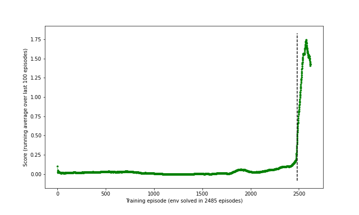

# Project 3: Collaboration and Competition

I chose to use the [Soft Actor-Critic (SAC)](https://arxiv.org/abs/1812.05905) algorithm (variant with automatic entropy tuning), since it is significantly more sample-efficient than PPO, and it is more robust and less sensitive to hyperparameters compared to DDPG and TD3.

I used an [open-source PyTorch implementation of SAC](https://github.com/pranz24/pytorch-soft-actor-critic), with a few minor refactors.

I tweaked the hyperparameters a bit starting on my project 2's final setup.

### Learning Algorithm

I implemented a [standard SAC agent with automatic entropy tuning](https://arxiv.org/abs/1812.05905), without any additional tricks.

The chosen hyperparameters for the algorithm and training regime are as follows:

* number of episodes (`num_episodes`): 5000 set (stopped after ~2600)
* discount factor for environment (`gamma`): 0.95
* number of neurons in each hidden layer (`hidden_layers`): (64, 64)
* learning rate (`lr`): 2e-4
* target network soft exponential update gain (`tau`): 0.005
* soft-update target network after every N env steps (`target_update_interval`): 1
* training batch size (`batch_size`): 256
* do one step of backprop learning after every N env steps (`updates_per_step`): 1
* replay memory buffer size (`buffer_size`): 50,000
* number of initial env steps using random actions rather than from agent (`num_init_random_steps`): 1000
* initial SAC entropy coefficient (`initial_entropy`): 1.0
* automatic entropy coefficient tuning (`automatic_entropy_tuning`): True

In particular, the actor network, critic networks, and target critic networks, are completely independent and do not share any layers or weights. All network architectures are identical, having 2 fully-connected layers (MLP) with rectified linear unit (ReLU) activation, and a final linear layer. The two critic networks and two target critic networks use this architecture directly to regress the Q value. In contrast, the actor network uses two separate final linear layers to predict the mean and standard deviation for a parametrized Gaussian distribution over the continuous action space. This distribution is then squashed using a hyperbolic tangent function, and then shifted and scaled into the action space's bounds (which does nothing in this setup since the Reacher env's action space has identical bounds to the tanh, i.e. between -1 and +1).

### Plot of rewards

As shown below, my agent solved the environment in 2485 episodes (a.k.a. reached an average reward over 100 past episodes of at least +0.5).

### Future Work Ideas

* Integrate training loop into [Ray Tune](https://docs.ray.io/en/latest/tune/index.html) and perform efficient automated hyperparameter tuning (e.g. using Bayesian Optimization, or Population-Based Bandits).
* Apply learning rate decay, curriculum learning, and [Hindsight Experience Replay](https://arxiv.org/abs/1707.01495) to speed up convergence during training.
* Investigate potential training improvements upon SAC with [Optimistic Actor-Critic](https://arxiv.org/abs/1910.12807).